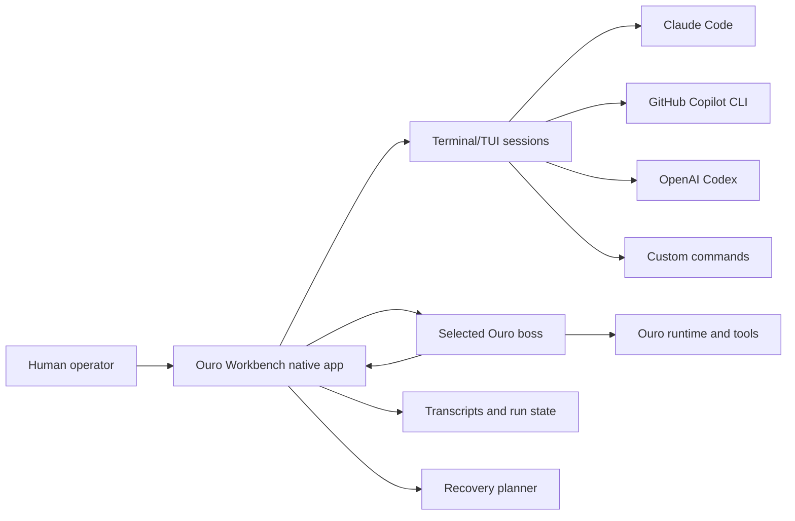

# Ouro Workbench Guide

Ouro Workbench is a native macOS control room for terminal agents.

The promise is simple: Claude Code, GitHub Copilot CLI, OpenAI Codex, local
shells, and arbitrary terminal/TUI agents should feel like real terminal
sessions, while a selected Ouro boss agent can answer what is happening, what is
waiting on the human, and what can safely keep moving.

Ouro does not replace the terminal agents. Ouro is the observer, coordinator,
and control layer around them.

## Product Contract

Workbench is built around these commitments:

- Native macOS app first. The terminal surface is not a web app in disguise.
- The primary organization model is cmux-like: named groups in the sidebar,
  with any number of terminal tabs inside each group.
- Arbitrary terminal/TUI agents are first-class terminal tabs.
- Claude Code, GitHub Copilot CLI, and OpenAI Codex are detected from the
  launched command. They are not separate app modes or hard-coded top-level
  tabs.
- The selected Ouro boss can inspect the group/tab map and control trusted
  Workbench sessions.
- Local Ouro agents are discovered from `~/AgentBundles/*.ouro`; Workbench can
  switch the boss, register MCP, reveal bundles, and open install terminals for
  new or cloned agents.
- Restart recovery is truthful. Processes do not survive reboot, but sessions,
  transcripts, identity, attention state, and safe resume plans persist.
- Human interaction with terminals stays ergonomic. The human can type, copy,
  paste, interrupt, launch, stop, and recover sessions directly.
- Boss actions are auditable. Control is trusted, but it is not invisible.

## Mental Model



### Session

A session is one Workbench-owned terminal/process tab. It has a name, command,
working directory, trust posture, transcript history, recovery policy, and
attention state.

Sessions can be local shells, named coding agents, custom TUI agents, or
ordinary commands. They remain in the sidebar even when stopped so their
history, recovery state, and transcript tail stay reachable.

### Group

A group is a named project/workspace scope. It owns terminal tabs, a root path,
and the boss context needed to answer questions like "what is going on in this
project?" without flattening every terminal on the machine into one list.

Use groups the way you would use cmux project scopes: one group for a repo,
campaign, client, or workstream; then open as many terminal tabs as that scope
needs.

### Terminal Tab

A terminal tab is one Workbench-owned terminal/process entry. It can be a local
shell, Claude Code, GitHub Copilot CLI, OpenAI Codex, another TUI agent, or an
ordinary command.

Known CLIs are detected from the command:

| Detected CLI | Launch shape | Recovery posture |
| --- | --- | --- |
| Claude Code | `claude` | Resume by session id when known, otherwise `claude --continue`. |
| GitHub Copilot CLI | `gh copilot -- --yolo` for trusted tabs | Explicit respawn/checkpoint recovery until native resume behavior is verified. |
| OpenAI Codex | `codex` | Resume by session id when known, otherwise `codex resume --last`. |

This detection affects labels, executable health, recovery planning, and the
state prompt sent to the selected Ouro boss. A custom tab named "Auth refactor"
that launches `claude --dangerously-skip-permissions` is still a Claude Code
tab for readiness and recovery.

### Boss

The boss is the selected Ouro agent for the Workbench. On this machine the
default boss is `slugger`.

The boss is allowed to answer operational questions:

- What is currently going on?
- Is anything waiting on me?
- Which terminal agents are active?
- What blockers exist?
- What safe action would move trusted work forward?

The boss is also allowed to request Workbench actions, but the native app still
applies local trust gates before executing them.

### TTFA

The `TTFA` badge is the autonomy readiness indicator.

It is not decorative. It answers whether the selected boss can run the
Workbench with minimal babysitting.

TTFA checks:

- selected boss agent name is valid
- Workbench MCP is registered for that boss
- detected agent terminals are trusted when boss control is expected
- detected agent terminals have automatic restart strategies when they should
  recover without help
- detected agent terminal executables are available
- no session requires manual recovery
- Boss Watch is running, or clearly called out as paused

States:

| State | Meaning |
| --- | --- |
| Ready | Boss bridge, detected agent terminals, executables, and recovery posture are clear. |
| Attention | Workbench is usable, but something should be tightened before hands-off operation. |
| Blocked | Human-free operation is blocked until the listed issue is fixed. |

Click the badge to see the exact checks. When an obvious local fix exists, the
popover can apply it.

### Trust

Trust is the line between "this is a terminal I own and the boss may operate"
and "this is visible, but not autonomous."

Trusted sessions may be launched, recovered, terminated, or sent input by the
boss. Untrusted or archived sessions remain inspectable in the UI, but boss
control is denied.

Sessions are **trusted by default** — the boss manages everything unless you
say otherwise. Mark a session untrusted ("hands off") when you want to drive it
yourself. (Destructive and secret prompts are never auto-answered regardless of
trust.)

### Friend

A session's friend is the person or agent it acts for — a `human` or an `agent`,
with a trust level (`family` / `friend` / `acquaintance` / `stranger`). It is
whose preferences the boss applies when deciding what a waiting session needs.

By default a session resolves to the **machine owner** (your local user account,
family trust) — the same way the Ouro CLI resolves a local session — so you
rarely set this. You only assign a friend explicitly when a session belongs to
someone else (a teammate, or a delegated agent). `family` and `friend` are the
trusted levels; `acquaintance` and `stranger` are never auto-advanced.

### Recovery

Recovery is not magic process immortality. It is honest restoration.

Workbench persists enough state to recover the operating surface after an app
restart or computer restart:

- session definitions
- working directory
- latest run metadata
- transcript paths
- attention state
- recovery policy
- known native session ids where available

Startup recovery classifies sessions as:

| Action | Meaning |
| --- | --- |
| `autoResume` | The underlying agent has a native resume route and policy allows it. |
| `respawn` | Workbench can relaunch the command and provide checkpoint context. |
| `manualActionNeeded` | A human or boss must inspect before recovery is safe. |
| `noAction` | Nothing should be restarted automatically. |

## First Run

Build and test from the repo:

```bash
swift build
swift test
```

Install and open the native app on this Mac:

```bash
scripts/install-app.sh --open
```

Then run first-run setup in the app:

1. Click the wand button or choose `Set Up Workbench` from the command palette.
2. Read the welcome page, then choose which local Ouro agent should be this
   Mac's boss. The boss is the operator's agent for this machine; it is not the
   Desk worker and it is not tied to any single terminal tab. Click anywhere on
   an agent row to select it.
3. On the Connect page, choose `Enable Tools` if Workbench MCP is not already
   registered for that boss. Workbench then automatically runs mandatory live
   provider checks for both the outward and inner lanes. If no boss is ready,
   Workbench offers the right `ouro hatch`, `ouro clone`, `ouro connect`,
   `ouro repair`, provider repair, or Workbench MCP registration move.
   Human-secret entry stays inside Ouro's own terminal/browser auth flows.
4. Once the boss is ready, choose `Scan Recent Work`. Workbench inspects recent local
   Workbench, Claude Code, Codex, Copilot/shell, and persistent-terminal
   evidence from the last week. If cmux is installed, it also reads cmux's
   saved workspace file and matches live Claude Code panes by TTY/session id.
5. Workbench proposes an arrangement: Desk tracks become Workbench groups, and
   resumable terminal-agent sessions become terminal tabs with Desk task refs.
   It shows the full evidence set, but only preselects a small, recent,
   high-confidence starter set so `Arrange` does not flood the Workbench with
   stale tabs.
6. Tap any row to toggle whether that terminal participates in `Arrange`. Use
   the per-group checkbox to select or clear an entire group at once. The
   live `selected / total` count and the `Arrange` button itself reflect your
   selection — `Arrange` stays disabled with an explanatory tooltip if you
   clear everything.
7. Use `Preview` on any row to inspect the source summary, confidence
   rationale, resume command, evidence paths, and a scrollable chat-style
   session excerpt when Workbench can resolve one from Claude, Codex, or
   Workbench history.
8. Choose `Arrange` to create groups/tabs, mirror selected work into Desk, and
   resume the terminals you selected. Workbench reports what it did in a
   transient banner and dismisses the onboarding sheet so the new terminals
   are immediately reachable; an `Open` shortcut jumps to the first imported
   terminal.
8. Use the Desk Bridge buttons for Claude Code and Codex sessions that should
   get the Ouro MCP bridge inside that terminal harness. This is independent of
   boss selection: the boss observes the Workbench; the bridge lets the
   terminal agent use the Desk.
9. Collapse the boss pane when you want maximum terminal height, turn on `Open
   at Login`, start `Watch`, click `TTFA`, and run `Recovery Drill` before
   trusting a long-running workspace.

The packaged MCP executable lives inside the installed app:

```bash
"/Users/arimendelow/Applications/Ouro Workbench.app/Contents/MacOS/OuroWorkbenchMCP"
```

### Moving From cmux

Workbench treats cmux as an import source, not as a PTY host to commandeer. The
safe migration is:

1. Leave cmux running while Workbench scans.
2. Let onboarding read `~/Library/Application Support/cmux/session-com.cmuxterm.app.json`.
3. Review the proposed Workbench groups. cmux workspace titles become preferred
   Workbench group names when available.
4. Arrange only the sessions you want Workbench to own.
5. Quit or idle the original cmux Claude pane before doing new work in the
   Workbench-resumed tab.

The onboarding Setup Assistant is available throughout this flow. Ask the
selected boss questions like "which sessions should I import?" to get an inline
reply, or type direct setup requests like "scan recent work" once the Connect
page shows the boss is ready. Typed setup requests use the same readiness gates
as the visible buttons, so provider or Workbench-tool repairs stay mandatory.

For Claude Code panes, Workbench matches the live process by TTY and
`--session-id`, then creates a `claude --resume <session>` command. It preserves
high-trust launch posture such as `--dangerously-skip-permissions` and
`--permission-mode bypassPermissions`, but it intentionally drops cmux hook
settings so the resumed tab belongs to Workbench.

Registering Workbench MCP writes an `ouro_workbench` server entry into the
selected boss agent bundle:

```json
{
  "mcpServers": {
    "ouro_workbench": {
      "command": "/Users/arimendelow/Applications/Ouro Workbench.app/Contents/MacOS/OuroWorkbenchMCP",
      "args": []
    }
  }
}
```

## Main Window

### Sidebar

The sidebar is the cmux-style organizer.

Use the `Groups` section for project/workstream scopes. Selecting a group shows
only that group's active terminal tabs and archived tabs. Group actions let you
rename a group or delete it once it is empty. The terminal row status dot and
subtitle give the quick read. `New Group` creates a scope; `New Terminal`
creates an arbitrary terminal/TUI agent tab in the selected group. Recovery
summary rows show whether anything needs restart handling.

### Boss Dashboard

The upper dashboard is the coordination surface.

Use the header eye button to collapse or restore this pane. Collapsing it
preserves Boss Watch and boss state; it only gives the human more terminal
space.

Important rows:

- `Boss Watch`: shows whether automatic observation is paused, running, or
  errored.
- `Boss Line`: a direct question box for the selected Ouro boss.
- Quick asks: `What's Going On?`, `Waiting On Me?`, `Keep Moving`, and
  `Respond For Me`.
- `Ouro Agents`: discovers local agent bundles, shows provider/model lane
  health, switches the boss, registers Workbench MCP, reveals bundles, and opens
  managed terminals for conversational `ouro hatch` or remote-bundle
  `ouro clone`.
- `Transcript Search`: searches persisted transcript lines across runs.
- `Native Runtime`: shows `Open at Login`.
- `Recovery Drill`: dry-runs restart recovery without changing state.
- `Workbench MCP`: shows and refreshes boss MCP registration.
- `Action Log`: records applied or denied Workbench actions.

### Terminal Pane

The lower pane is the terminal surface for the selected session.

The selected-session header shows the launch command plus compact trust and
restart-posture chips so you can tell whether the boss may operate the session
and whether it participates in restart recovery.

Use it like a normal terminal:

- type directly into the terminal
- use `Full Screen` or `Command-Shift-F` to give the running terminal the whole
  window
- use `Command-Shift-F` again to return to the split workbench view
- use `Redraw` or `Command-L` to send Ctrl-L after a resize or TUI repaint issue
- send `Ctrl-C`
- send `Esc`
- send `EOF` / Ctrl-D
- stop a running session
- restart or recover a stopped session
- ask the boss about only this session with `Ask Boss`

The terminal pane is intentionally operational. It should not feel like a
settings page with a terminal stapled on.

### Command Palette

Press `Command-K` to open the native command palette.

The palette is token-aware and understands operator aliases. Queries like
`diag folder`, `boss selected`, `mcp refresh`, `signal eof`, and `copy command`
find the relevant actions even when the visible title uses different wording.
It includes boss quick asks, workspace refresh, Ouro-agent refresh, Workbench MCP
install/refresh, release-page open, diagnostics reveal/copy/open-folder, report a
bug, open the bug-reports folder, selected-terminal Ask Boss, launch, focus,
redraw, Ctrl-C, Esc, EOF, copy command, open working directory, reveal
transcript, stop, and recover.

Useful shortcuts (the full, authoritative map lives in
`Sources/OuroWorkbenchCore/WorkbenchGuide.swift` and is shown in-app with
`Command-/`; the boss and inner agents read the same catalog — see
[Agent Awareness](#agent-awareness)):

| Shortcut | Action |
| --- | --- |
| `Command-N` | New session |
| `Command-K` | Command palette |
| `Command-I` | Boss check-in |
| `Command-Return` | Launch or restart selected session |
| `Command-.` | Stop selected session |
| `Command-L` | Redraw selected running terminal |
| `Command-Shift-F` | Enter or exit terminal focus |
| `Command-F` | Focus or run transcript search |
| `Command-Shift-B` | Report a bug (bundles screenshot, diagnostics, and recent activity) |
| `Command-/` | Show the full keyboard shortcut reference |

## Daily Operating Loops

### Ask What Is Happening

Use `Boss Line` or the quick ask `What's Going On?`.

The boss receives a Workbench-grounded prompt containing workspace state,
processes, recovery posture, recent action log, and transcript paths. It can
answer in plain language and, when appropriate, include an action request for
the native app.

### Check Whether Anything Is Waiting

You don't have to ask. Workbench watches each running session's output and, when
one goes idle at a prompt that needs a decision (an approval menu, a `y/N`, a
selection list, "press enter"), it flags that session **waiting on you** on its
own — the sidebar dot turns orange, and it surfaces in the menubar, Boss Watch,
and notifications.

Press **⌘J** to jump straight to the next session that needs you (waiting,
needs review, or blocked), across all groups. That's the core loop: the
workbench tells you who needs you and takes you there, so you never scan panes.

You can still ask the boss `Waiting On Me?` for a narrated summary that also
folds in Ouro mailbox items, recovery plans, and the action log.

See [The Attention Inbox](#the-attention-inbox) for letting the boss handle the
routine ones for you.

### Keep Work Moving

Use `Keep Moving` when you want the selected boss to take routine action on
trusted sessions.

Examples:

- recover a stopped Codex session
- send `continue` to a running agent
- launch a trusted terminal tab that should be active
- terminate a stuck session if the state makes that safe

Boss-requested actions use this fenced format:

````markdown
```ouro-workbench-actions
[
  {
    "action": "sendInput",
    "entry": "PROCESS-ID",
    "text": "continue",
    "appendNewline": true
  }
]
```
````

Supported actions are `launch`, `recover`, `terminate`, and `sendInput`.

The app authorizes each action before execution. Names are accepted only when
unique, but process ids are preferred because they remove ambiguity.

### Respond On Your Behalf

Use `Respond For Me` for routine replies.

This should be reserved for cases where the boss can infer the answer from
state and policy. The point is not to hide judgment. The point is to avoid
making the human type obvious connective tissue while agents are already doing
useful work.

### Work Directly In A Terminal

When you want to steer a session yourself, do it directly in the terminal pane.

Workbench should preserve the human's terminal muscle memory: keyboard focus,
copy/paste, interruption, quick responses, and obvious stop/restart controls.
Boss control is additive. It is not a replacement for the human being able to
grab the wheel.

### Let Boss Watch Run

Turn on `Watch` when you want the boss to notice changes without being asked.

Boss Watch keeps a rolling baseline of workspace state. It notices run
transitions, attention changes, archive/restore operations, recovery state, and
applied actions. When something meaningful changes, it asks the selected boss
to summarize and move trusted work forward if the next action is clear.

Paused Boss Watch is a warning, not a full blocker. Manual asks still work.

## Operator Recipes

### Start A Coding Swarm

1. Open Workbench.
2. Select the group for the project.
3. Open the terminal tabs you want active.
4. Verify each autonomous tab is trusted.
5. Turn on `Watch`.
6. Ask `What's Going On?`.
7. Ask `Keep Moving`.
8. Let the boss request routine Workbench actions while you stay available for
   real decisions.

This is the happy path: terminal agents keep their own native interfaces, and
the boss keeps the whole room oriented.

### Find Out Whether You Are Blocking Anything

1. Click `Waiting On Me?`.
2. Read the boss summary.
3. If the boss identifies a single terminal waiting for a routine reply, use
   `Respond For Me` or let the boss send input.
4. If the boss identifies a real human judgment call, answer in the terminal or
   route the decision back through the boss.

The goal is to separate "needs Ari" from "needs a boring next token."

### Recover After A Restart

For app quit, force-quit, or reinstall, just reopen Workbench. Running terminal
tabs should reattach to the same underlying session and continue where they
were. The only Workbench control that intentionally ends a terminal session is
`Stop`.

For an actual computer restart:

1. Reopen Workbench, or let `Open at Login` do it.
2. Let startup reconciliation run.
3. Read the recovery summary in the sidebar.
4. Click `TTFA`.
5. Run `Recovery Drill` if anything looks surprising.
6. Ask `Waiting On Me?` so the boss can explain what did and did not resume.
7. Use `Keep Moving` once the recovery picture is clean.

Recovery should feel boring. If it feels mysterious, that is a product bug or a
missing guide entry.

### Clear The Terminal

Use the normal shell `clear` command. Workbench launches terminals with
xterm-compatible capabilities, so `clear` should repaint the visible pane just
like a native terminal. Workbench keeps durable history in transcripts instead
of backing `screen` scrollback, which prevents old output from returning after
focus changes or window resizes. If old output stays visible after `clear`,
treat it as a bug in the terminal surface rather than a shell problem.

### Add A New Terminal/TUI Agent

1. Select or create the group that should own the tab.
2. Click `New Terminal`.
3. Name it after the actual agent or task role.
4. Set the command exactly as you would run it in a terminal.
5. Set the working directory to the project root the agent should inhabit.
6. Mark it trusted only if the boss may operate it.
7. Turn on auto-resume only when respawn or native resume is safe.
8. Launch it and confirm the terminal behaves normally.
9. Ask `Ask Boss` on that session so the boss learns how it appears in the
   Workbench.

Any terminal command can be a session. The important part is giving it enough
identity and recovery context to be governed.

### Let The Boss Nudge One Session

1. Select the session.
2. Click `Ask Boss`.
3. Read the focused answer.
4. Accept or observe any Workbench action the boss requests.
5. Check `Action Log` if the result is surprising.

This is the surgical version of Boss Line. Use it when the global room summary
is too broad.

## Adding A Terminal/TUI Agent

Use `New Terminal` inside the selected group.

Recommended fields:

- Name: the human-readable tab name.
- Command: the executable and arguments.
- Working directory: the project or workspace root.
- Trust: trusted only when you are comfortable letting the boss operate it.
- Auto-resume: on when the command has a safe resume or respawn posture.
- Notes: anything the boss or future human should know about the tab.

Good custom-session examples:

```text
opencode --dangerously-skip-permissions
```

```text
aider --yes-always
```

```text
zsh -l
```

Archive a terminal tab when it should remain historically visible but no longer be
launchable or controllable. Restore it when it becomes active work again.
Use `Move` to transfer a stopped tab into another group; Workbench updates its
working directory to that group's root so future launches inherit the new
scope.

## Boss And Ouro CLI Integration

Workbench talks to the selected boss through the Ouro CLI:

```bash
ouro mcp-serve --agent <boss>
```

There are two complementary routes:

| Route | Purpose |
| --- | --- |
| Boss conversation plane | Human-facing asks through `Boss Line`, `Check In`, `Ask Boss`, and Boss Watch. |
| Workbench MCP server | Tool surface the boss can call from its own Ouro runtime. |

Workbench MCP exposes:

| Tool | Purpose |
| --- | --- |
| `workbench_status` | Summarize persisted state, process entries, recovery plans, and transcript paths. |
| `workbench_sense` | Render the Workbench sense contract: boss boundary, group/Desk mirror, tool affordances, the action protocol, and the operator keyboard shortcuts (so the boss can answer how-do-I questions). |
| `workbench_transcript_tail` | Read a bounded tail from the latest transcript for a session. |
| `workbench_search_transcripts` | Search saved transcript lines across runs. |
| `workbench_recovery_drill` | Dry-run restart recovery planning. |
| `workbench_request_action` | Queue terminal control and organization actions for the native app. |

External MCP action requests are written to disk, drained by the native app, and
then authorized by the same trust gates used for boss conversation actions.

Supported queued actions are `launch`, `recover`, `terminate`, `sendInput`,
`createGroup`, `createTerminal`, `moveSession`, `setTrust`, `setAutoResume`,
`archive`, and `restore`. Entry-scoped actions use a process id or unique
session name in `entry`; group-scoped actions use a group id or unique group
name in `group`. The optional `trust` field is the string enum `trusted` or
`untrusted`; `autoResume` is a boolean. Invalid action payload types are
rejected instead of silently defaulted.

## The Attention Inbox

The inbox is the loop that lets you run many agents without babysitting each one:
**detect → decide → act → review → teach.** Full design in
[docs/preference-driven-inbox.md](preference-driven-inbox.md); here's how to drive it.

### How it works

1. **Detect.** Workbench watches each running session's output and flags it
   `waiting on you` when it's idle at a prompt that needs a decision. (Press
   **⌘J** to jump to the next one.)
2. **Decide.** The moment a session is flagged (and on a periodic backstop
   poll), the boss reads its waiting prompt and that session's **friend**, and
   decides from that friend's preferences: *auto-advance* (answer it),
   *escalate* (leave it for you), or *hold*.
3. **Act.** If the decision is auto-advance and it clears the gate (below), the
   boss sends the answer for you. Otherwise it's left for you.
4. **Review.** Every decision — acted or not, with the reasoning — is in the
   **Boss Decision Log** (`⌘K` → "Boss Decision Log").
5. **Teach.** From any log entry, reinforce a good call ("auto-advance these
   next time") or correct a wrong one ("always ask me"). The boss saves that as
   a standing preference for that friend, so it improves.

### Auto-advance is on by default

You don't turn it on — it's automatic out of the box: sessions are **trusted by
default**, **Boss Watch** is on, and **Settings → Boss → "Let the boss
auto-advance"** defaults on. To exclude a session, mark it **untrusted**
("hands off"); to stop all of it, flip the Settings toggle off (the boss then
escalates everything).

Day one is conservative by design even so: with no learned preferences yet, the
boss has nothing to act on, so it escalates everything. You teach from the log,
and it starts auto-advancing what you've approved.

### The gate (when the boss may actually send input)

Auto-advance fires only when **all** hold:

- the global kill-switch is on, and
- the session is still **running** and still **waiting** at send time (so a
  prompt that changed while the boss was thinking is never answered blindly), and
- the session is **Trusted**, and
- the friend's trust is **family** or **friend**, and
- the prompt is **not** destructive, secret-bearing, financial, a deploy, or an
  agreement — those **always** escalate, even if a preference seems to allow it.

Anything that doesn't clear the gate is recorded in the log with the reason and
left for you. Nothing is ever sent twice for the same prompt.

## Agent Awareness

Workbench describes itself from one catalog,
[`Sources/OuroWorkbenchCore/WorkbenchGuide.swift`](../Sources/OuroWorkbenchCore/WorkbenchGuide.swift),
so every surface stays in lockstep. Edit shortcuts, the boss capability list, or
the action verbs there and nowhere else:

| Surface | Reads |
| --- | --- |
| In-app shortcut sheet (`Command-/`) | `WorkbenchGuide.shortcutCategories` |
| Boss `workbench_sense` | tools, action protocol, and shortcuts from the same catalog |
| Boss check-in prompt | tool names and action verbs from the same catalog |
| Inner agents (Claude/Codex/shell) | the rendered context file (below) |

The action verbs are derived directly from the `BossWorkbenchActionKind` enum, so
the verbs advertised to the boss are exactly the verbs the parser accepts.

### Inner-Agent Awareness

Every terminal Workbench launches inherits environment markers so the agent
inside can detect and describe its host:

| Variable | Meaning |
| --- | --- |
| `OURO_WORKBENCH=1` | This session is running inside Ouro Workbench. |
| `OURO_WORKBENCH_VERSION` | The Workbench version that launched it. |
| `OURO_WORKBENCH_CONTEXT_FILE` | Path to a markdown brief the agent can `cat`. |
| `OURO_WORKBENCH_GROUP` | The group the session lives in. |
| `OURO_WORKBENCH_SESSION` | The terminal's display name. |
| `OURO_WORKBENCH_BOSS` | The selected boss agent. |
| `TERM_PROGRAM=OuroWorkbench` | Legacy marker, still set. |

The context file (`…/Application Support/OuroWorkbench/agent-context.md`,
refreshed on every launch) is the same `WorkbenchGuide` catalog rendered for the
agent: what Workbench is, the keyboard map, the boss's tools, and a plain answer
to "what am I running in?". So when you ask Claude Code, Codex, or a shell agent
inside Workbench what it is running in, it can answer from `cat
"$OURO_WORKBENCH_CONTEXT_FILE"` instead of guessing. No files are written into
your project repositories.

## Restart Recovery Playbook

Use this to verify the restart promise.

1. Start the sessions you care about.
2. Confirm they are trusted if the boss should be able to recover them.
3. Confirm `Open at Login` is enabled.
4. Run `Recovery Drill`.
5. Fix anything classified as `manualActionNeeded` if it should be autonomous.
6. Restart the app, or eventually the computer.
7. Let Workbench reconcile startup state.
8. Check TTFA and the recovery summary.
9. Ask `Waiting On Me?` if anything looks ambiguous.

Expected behavior:

- Prior transcripts remain discoverable.
- Trusted sessions with supported resume strategies recover automatically.
- Respawnable sessions relaunch with checkpoint context.
- Unsafe sessions are marked for manual action instead of being silently
  restarted.
- The boss can inspect the recovery picture through MCP.

## Trust And Audit Rules

Boss and external actions are intentionally powerful, so the rules are simple
and visible:

- The target session must exist.
- The target session must be trusted.
- The target session must not be archived, except for `restore`.
- `sendInput` requires non-empty text and a running session.
- `launch` is skipped if the session is already running.
- `recover` requires an available recovery plan.
- `terminate` requires a running session.
- `createTerminal` and `createGroup` require explicit names.
- `moveSession`, `archive`, and `restore` only operate when the session state is safe for that change.
- Every applied or denied action is logged.

Auto-advance (the boss answering a waiting prompt for you) adds a second layer
on top of those rules: the session must be running and still waiting, the
session's friend must be trusted (`family`/`friend`), the global kill-switch must
be on, and the prompt must clear the safety floor — destructive, secret,
financial, deploy, and agreement prompts always escalate, never auto-answered.
Every auto-advance decision, acted or held with its reason, is in the Boss
Decision Log (`⌘K`), and you tune it by teaching from there. See
[The Attention Inbox](#the-attention-inbox).

This is TTFA in product form: trust the agent, keep the trail.

## Troubleshooting

| Symptom | What it usually means | Fix |
| --- | --- | --- |
| TTFA says blocked | The boss cannot fully inspect, control, or recover the workspace. | Click `TTFA`, read the blocker, and use the offered fix when present. |
| Workbench MCP is not registered | The selected boss cannot see Workbench tools from its own Ouro runtime. | Use the `Workbench MCP` row to register or refresh. |
| An agent executable is missing | The command is not available on the app's PATH. | Install or repair the CLI, then refresh readiness. |
| Boss Watch is paused | Automatic observation is off. | Turn on `Watch` when you want background coordination. |
| Boss Line fails | The Ouro CLI or selected boss process could not complete the ask. | Verify `ouro mcp-serve --agent <boss>` works in a terminal. |
| A prompt sits high or low after focusing a terminal | A shell or TUI did not repaint cleanly after attach, focus, or resize. | Workbench automatically sends Ctrl-L after attach, focus-mode entry, and meaningful resize; click `Redraw`, press `Command-L`, or use the command palette to force one more repaint if a stubborn TUI still needs it. |
| A session will not auto-recover | Trust, auto-resume, or native resume posture is missing. | Run `Recovery Drill` and inspect the reason. |
| A boss action is skipped | The action violated a local trust gate or current runtime state. | Check `Action Log` for the exact result. |
| The app did not reopen after restart | Login item state may be off or stale. | Toggle `Open at Login` off and back on, then refresh. |
| Release update check is unavailable | GitHub Releases could not be reached or no release exists yet. | Use the current installed build, then check again when online. |
| You hit a bug and want to report it | The app can bundle everything needed to debug into one folder. | Press `⇧⌘B` (or `Report a Bug…` in the More menu / `⌘K` palette), describe what happened, and click `Create Report`. |
| You need a safe diagnostics bundle only | The app can collect logs/crash reports without transcript contents. | Use `Support Diagnostics` in the boss dashboard, then reveal the zip, copy its path, or open the output folder from the command palette. |
| Transcript search finds nothing | The session may not have produced a persisted run transcript yet. | Launch the session, produce output, stop or switch, then search again. |

## Reporting Bugs

When something misbehaves, file a report from inside the app rather than
reconstructing the situation later. Press `⇧⌘B` (also `Report a Bug…` in the
**More** menu and the `⌘K` palette), write what you were doing and what went
wrong, and click `Create Report`.

Each report is a self-contained folder under
`~/Library/Application Support/OuroWorkbench/bug-reports/`, named with a
timestamp and a slug of your note (e.g. `20260528-140322-terminal-froze/`). It
bundles:

- `report.md` — app + macOS version, boss/Boss Watch/auto-advance posture, every
  current session (status, attention, trust, friend, branch, directory), the
  recent boss decision log (what the boss decided and *why*), and the recent
  action log.
- `screenshot.png` — a snapshot of the Workbench window, captured in-process so
  it never triggers a screen-recording permission prompt.
- `diagnostics.zip` — the support diagnostics bundle (logs and crash reports),
  collected automatically. If it fails, the report still writes and notes the
  failure under **Collection warnings**.

The bundle deliberately excludes terminal transcript contents. After it saves,
use `Reveal in Finder` or `Copy Path` to hand the folder off — it's laid out so
the boss agent (or Claude) can read it directly.

You can also click `File as GitHub Issue` to open the report as an issue on
`ourostack/ouro-workbench` (labelled `bug`) — a durable, searchable venue the
boss/Claude can read from anywhere. The issue body is `report.md`; the
screenshot and diagnostics zip stay in the local bundle, referenced by path
(the CLI can't upload them). This needs the GitHub CLI installed and
authenticated (`brew install gh` then `gh auth login`); if it isn't, the local
bundle is still saved and the reporter tells you what's missing.

## What Good Looks Like

A healthy Workbench has this shape:

- `TTFA` is ready or only has understood watch points.
- `Open at Login` is enabled.
- `Workbench MCP` is registered for the selected boss.
- Boss Watch is on during autonomous work blocks.
- Detected agent terminals are trusted, executable, and configured for the intended recovery posture.
- Custom terminal/TUI agents are named clearly and trusted deliberately.
- Recovery Drill reports no surprising manual actions.
- Action Log tells a clear story of what the boss did.
- The human can still sit down at any terminal and drive.

That last point matters. Workbench is not trying to make terminals disappear.
It is making them governable, recoverable, and legible to the agent who is
helping run the room.

## Current Limits

Workbench is already useful, but the truth matters:

- A computer restart still kills real processes and PTYs. Workbench restores
  sessions; it does not preserve a live Unix process across reboot.
- GitHub Copilot CLI native resume behavior is not treated as verified yet.
  Workbench uses explicit respawn/checkpoint recovery for that CLI.
- Boss `sendInput` only works for a running session with a retained controller.
- Workbench MCP registration currently points at the installed app bundle path.
- The app is distributed as an ad-hoc-signed preview. Apple Developer ID signing
  and notarization are separate release work.

Those limits are acceptable only because they are visible. The product should
always prefer an honest yellow light over a fake green one.
